# Moe2024 official Misc wp
## 杂项入门指北
打开图片仔细观察发现其中某条线是由'.'与'-'的组合，猜测为Morse Code

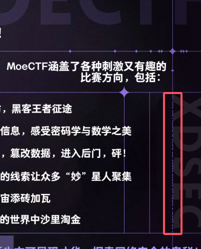
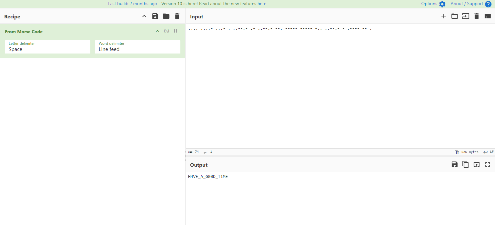

解码后即为flag`moectf{H4VE_A_G00D_T1ME}`

---
## signin
开启环境后按照要求将luo设为缺勤，其他代签后点完成即得flag

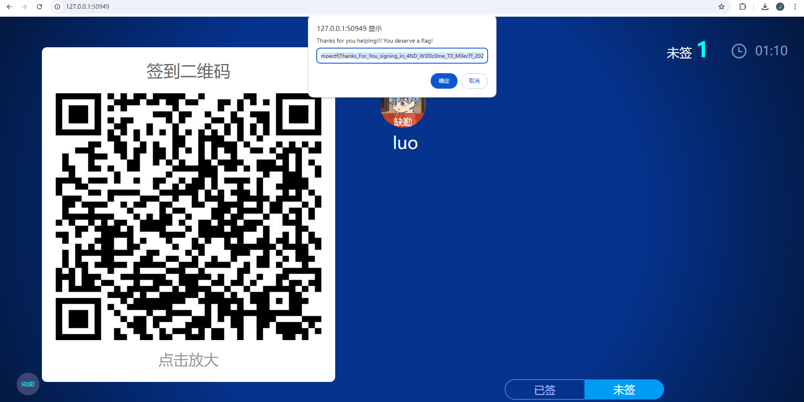

`moectf{Thanks_For_You_signing_in_4ND_W3l0c0me_T0_M0ecTf_2024!!!}`

---
## 罗小黑战记
题解1：stegsolve逐帧分析，找到flag相关的图片
题解2：简单的在线解码工具，去扫描二维码，（因为图片有两帧），可以捕捉到并识别
其他在线网站不予以罗列

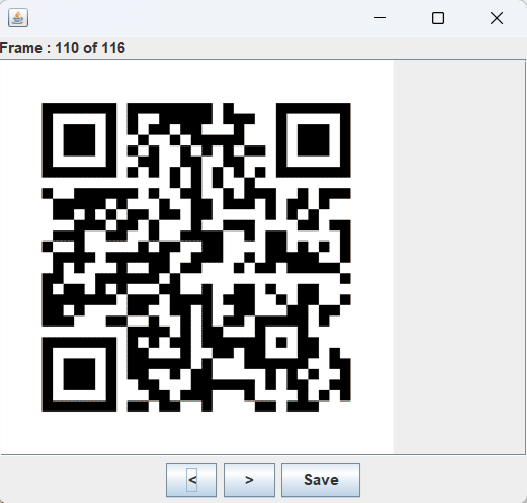

---
## ez_Forensics
下载附件后得到一个raw文件，但是用图片编辑器打不开，16进制也不像是raw图片，检索forensic相关可以知道这个raw
实际上为电脑内存镜像以及分析工具：volatility

分析题目可以知道flag之前出现在cmd命令中，正好cmdscan命令可以查看cmd历史命令,使用如下命令即可得到flag

`vol.py  -f /mnt/c/Users/Administrator/Downloads/flag__/flag.raw --profile=Win7SP1x64 cmdscan`

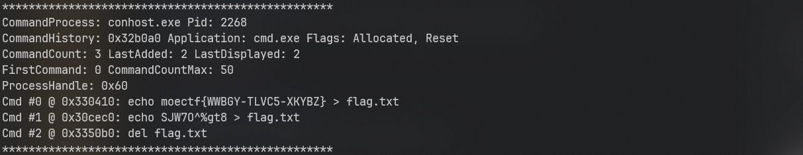

`moectf{WWBGY-TLVC5-XKYBZ}`

ps:这个题由于出题人的疏忽导致不需要使用vol工具以及取证相关知识也可做出，不过在此就不赘述了，先滑跪了orz

---
## so many 'm'
打开文本发现里面是一坨乱码，但仔细看会发现`moectf{}`等重要字符都出现过，故flag可能为某种排列方式，题目表示m出现的次数最多，联想到词频分析
又注意到提示 `如果有某几个字符无法判断顺序请按字典序排序` 对于出现次数相同的字符用字典序排序
```python
from collections import Counter

def frequency(file_):
    with open(file_, 'r', encoding='utf-8') as file:
        text = file.read()
    char_count = Counter(text)
    sorted_char_count = sorted(char_count.items(), key=lambda x: (-x[1], x[0]))
    for char, count in sorted_char_count:
        print(char, end='')

file_ = 'flag.txt'
frequency(file_)

# moectf{C0MpuTaskingD4rE}!#@bdhjlqvwxyz

```
flag即为`moectf{C0MpuTaskingD4rE}`

---
## Abnormal lag
打开音频发现刚开始以及末尾都有一小部分声音有异常，使用音频编辑器打开查看频谱图放大两处发现
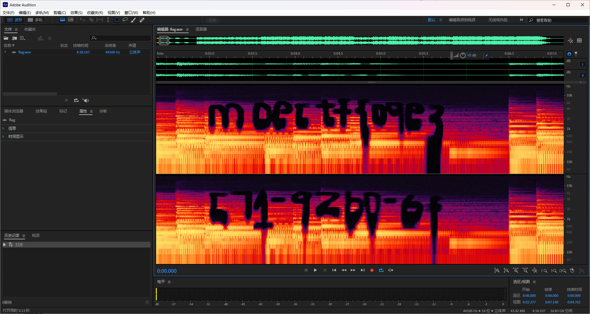
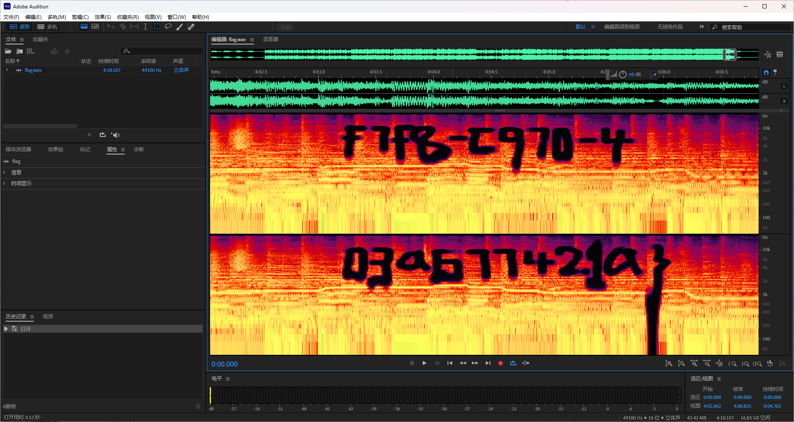

对于辨识问题 题目说了flag里只有a-f，所以不应该有那么多的辨识问题，不过还是吸取经验，下次尽量避免这种问题

`moectf{09e3f7f8-c970-4c71-92b0-6f03a677421a}`

---
## Misc问卷调查
填写问卷并提交即得flag
`moectf{thanks_for_filling_out_the_questionnaire}`

---
## ez_F5
下载图片后查看属性发现一串base32,解码为 `no_password`

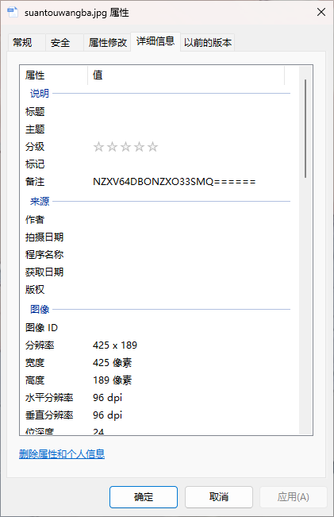

根据题目名称搜索f5等关键词，可以发现一个叫f5隐写的东西，甚至类似的wp也有很多，跟着做就行

其中会遇到的问题基本集中在：

### 1.没有提取出任何东西

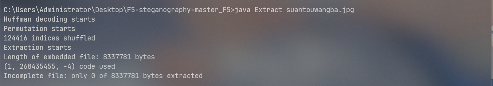

这是因为加密的时候有密码但是解密时无密码导致的（错误密码有时也会导致）

### 2.提取出了一堆乱码

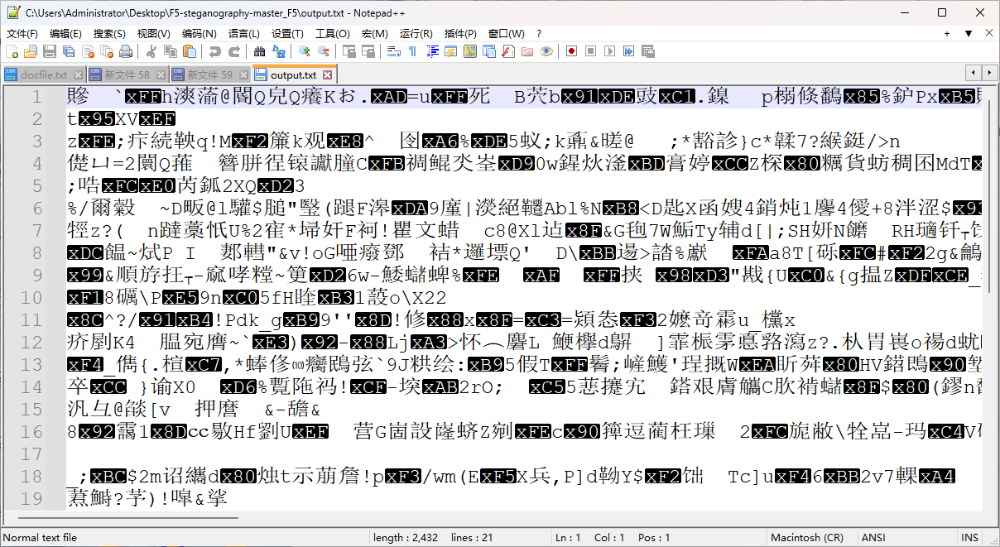

这是因为密码输错导致的

已知有密码但是他前面又给了一个`no_password`,所以密码就是`no_password`

输入正确密码提取后得到flag `moectf{F5_15_s0_lntere5t1n9}`

---
## the upside and down
010打开文件，选中"File"->"Export HEX" 导出为txt
在note pad++ 或者 记事本中，用正则匹配进行数据处理（删除了空格和回车）
参考倒置脚本如下
再"File"->"Import HEX", 打开就是png图片了
```python
def reverse_entire_file_content(input_file_path, output_file_path):

    with open(input_file_path, 'r', encoding='utf-8') as infile:
        content = infile.read()
    
    reversed_content = content[::-1]
    
    with open(output_file_path, 'w', encoding='utf-8') as outfile:
        outfile.write(reversed_content)

input_file_path = r'输入 TXT 文件路径' 
output_file_path = '输出 TXT 文件路径'  

reverse_entire_file_content(input_file_path, output_file_path)
```
可实现的脚本很多，不予以罗列

---
## ctfer2077①
给了一张二维码图片，直接扫获得一个b站视频bv号，不过进去发现是被骗的视频，flag还是藏在图片中

将图片使用010或者windex打开搜索flag会得到以下内容

`where is the flag? OK I give you some hints:incomplete LSB`

将图片载入stegsolve中发现只有Red0通道有隐写，这也是为什么叫做不完全的lsb
 
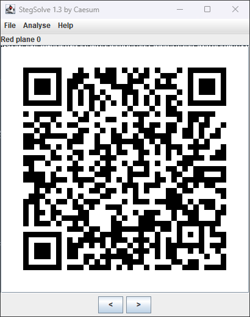


提取获得flag `moectf{84d7f247-3cba-4077-ba25-079f3ac7bb8a}`

---
## ez_usbpcap

键盘流量，先拿tshark提取hid data（也可以按照如下脚本，实现一键提取）
最后用这个脚本即得（此脚本为引用后加以更改，感谢原师傅wangyihanger）
此题易错点是：拿数字键盘区输入的数字，很多常见脚本都没有对应的键值对，需要大伙自己去搜加进去,补全脚本
``` python
#!/usr/bin/env python

import sys
import os

DataFileName = "usb.dat"

presses = []

normalKeys = {"04": "a", "05": "b", "06": "c", "07": "d", "08": "e", "09": "f", "0a": "g", "0b": "h", "0c": "i",
              "0d": "j", "0e": "k", "0f": "l", "10": "m", "11": "n", "12": "o", "13": "p", "14": "q", "15": "r",
              "16": "s", "17": "t", "18": "u", "19": "v", "1a": "w", "1b": "x", "1c": "y", "1d": "z", "1e": "1",
              "1f": "2", "20": "3", "21": "4", "22": "5", "23": "6", "24": "7", "25": "8", "26": "9", "27": "0",
              "28": "<RET>", "29": "<ESC>", "2a": "<DEL>", "2b": "\t", "2c": "<SPACE>", "2d": "-", "2e": "=", "2f": "[",
              "30": "]", "31": "\\", "32": "<NON>", "33": ";", "34": "'", "35": "<GA>", "36": ",", "37": ".", "38": "/",
              "39": "<CAP>", "3a": "<F1>", "3b": "<F2>", "3c": "<F3>", "3d": "<F4>", "3e": "<F5>", "3f": "<F6>",
              "40": "<F7>", "41": "<F8>", "42": "<F9>", "43": "<F10>", "44": "<F11>", "45": "<F12>", "54": "/",
              "55": "*", "56": "-", "57": "+", "59": "1", "5a": "2", "5b": "3", "5c": "4", "5d": "5", "5e": "6",
              "5f": "7", "60": "8", "61": "9", "62": "0", "63": ".", "67": "="}

shiftKeys = {"04": "A", "05": "B", "06": "C", "07": "D", "08": "E", "09": "F", "0a": "G", "0b": "H", "0c": "I",
             "0d": "J", "0e": "K", "0f": "L", "10": "M", "11": "N", "12": "O", "13": "P", "14": "Q", "15": "R",
             "16": "S", "17": "T", "18": "U", "19": "V", "1a": "W", "1b": "X", "1c": "Y", "1d": "Z", "1e": "!",
             "1f": "@", "20": "#", "21": "$", "22": "%", "23": "^", "24": "&", "25": "*", "26": "(", "27": ")",
             "28": "<RET>", "29": "<ESC>", "2a": "<DEL>", "2b": "\t", "2c": "<SPACE>", "2d": "_", "2e": "+", "2f": "{",
             "30": "}", "31": "|", "32": "<NON>", "33": ":", "34": "\"", "35": "<GA>", "36": "<", "37": ">", "38": "?",
             "39": "<CAP>", "3a": "<F1>", "3b": "<F2>", "3c": "<F3>", "3d": "<F4>", "3e": "<F5>", "3f": "<F6>",
             "40": "<F7>", "41": "<F8>", "42": "<F9>", "43": "<F10>", "44": "<F11>", "45": "<F12>"}


def main():
    # check argv
    if len(sys.argv) != 2:
        print("Usage : ")
        print("        python UsbKeyboardHacker.py data.pcap")
        print("Tips : ")
        print("        To use this python script , you must install the tshark first.")
        print("        You can use `sudo apt-get install tshark` to install it")
        print("Author : ")
        print("        WangYihang <wangyihanger@gmail.com>")
        print("        If you have any questions , please contact me by email.")
        print("        Thank you for using.")
        exit(1)

    # get argv
    pcapFilePath = sys.argv[1]

    # get data of pcap
    os.system("tshark -r %s -T fields -e usbhid.data  > %s " % (pcapFilePath, DataFileName)) #此段'usbhid.data需要根据题目更改'

    # read data
    with open(DataFileName, "r") as f:
        for line in f:
            presses.append(line[0:-1])
    # handle
    result = ""
    for press in presses:
        if press == '' or len(press) !=16 :
            continue

        if ':' in press:
            Bytes = press.split(":")
        else:
            Bytes = [press[i:i + 2] for i in range(0, len(press), 2)]

        #    标志位以及数据位也要根据题目更改
        if Bytes[0] == "00":
            if Bytes[2] != "00" and normalKeys.get(Bytes[2]):
                result += normalKeys[Bytes[2]]
        elif int(Bytes[0], 16) & 0b10 or int(Bytes[0], 16) & 0b100000:  # shift key is pressed.
            if Bytes[2] != "00" and normalKeys.get(Bytes[2]):
                result += shiftKeys[Bytes[2]]
        else:
            print("[-] Unknow Key : %s" % (Bytes[0]))
    print("[+] Found : %s" % (result))

    # clean the temp data windows注释掉第二行，保留第二行;linux注释掉第二行，保留第一行
    os.system("rm ./%s" % (DataFileName))
    os.remove(DataFileName)

if __name__ == "__main__":
    main()
```
即得flag：moectf{n1ha0w0y0udianl32451}

---
## 捂住一只耳
音频中可以听到" moef 63 31 43 31 41 52 31 51 71 101"

只观察数字最后一位可以发现都是123，按照题目info描述以及键盘考点相关搜索，可以发现键盘坐标图（也有被叫做键盘密码？）对应的是nevergetup，题目中描述按到了caps键，也就是大写键，即得flag：moectf{NEVERGETUP}

---

## the_secret_of_snowball
压缩包解压之后得到jpg图片
1.jpg文件打不开，010打开发现文件头是 FFD6 , 修复文件头为 FFD8
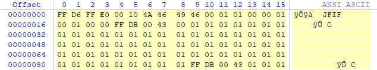

2.修复好之后拿到前一部分flag
3.文件尾隐写信息，由等号、大写字母等判断base64，解密即得后一部分flag
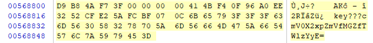

---
## Find It
放到图片可以看到几个建筑物：雄峰集团 美居酒店等,又因为在西安市，直接地图搜索
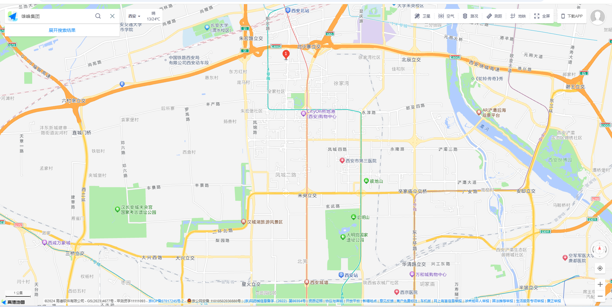

不同的地图可能搜的不一样，可能会有2个雄峰，但再搜索美居酒店，两个在一起的就只有地图的①标，又因为美居酒店在雄峰集团的右后方
所以拍摄视角为：
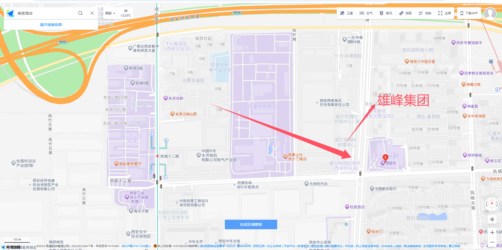

直接在小区找幼儿园即可(读音问题也是非常抱歉，我是百度的读音，就直接上了orz)

`moectf{ji_di_bao_you_er_yuan}`

---
## 我的图层在你之上
下载附件后直接扔到010中拖到最后可以发现一个链接


打开链接发现是一个图片编辑器，将pdf扔进去发现自动分层了五份，也只有矢量pdf有这样的性质，这也是提示的原因（其实刚开始这个网站是没给的，
但这样的话有点恶心了（虽然感觉大家还是走偏了，orz

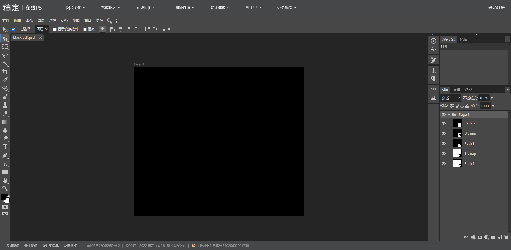

其中path1，3，5都是在生成矢量pdf是产生的三个图层，而Bitmap的两个图层正是我们需要的，将图层提取出来后给两张图片做ADD位运算就能得到key
（这里有一个问题就是出题人使用了弱密码，所以猜或者爆破也不失为一种好方法，orz

揭开压缩包后得到caesar.txt为凯撒加密，解密后得到flag 

`moectf{d751894b-ee0a-47dd-85d4-e92d0443921f}`

---

## 时光穿梭机

#### 1.确认王建墓
此题应该去逐字查看;

认真审题首先想到《伦敦新闻画报》《the illustrated London News》，结合时间地点去查找
法一：
https://www.britishnewspaperarchive.co.uk/search/results/1946-04-20/1946-04-20?FreeSearch=&PhraseSearch=&SomeSearch=&AnySearch=&NotSearch=&SortOrder=2&FrontPage=&Region=&County=london%2C+england&Place=&NewspaperTitle=illustrated%2Blondon%2Bnews&PublicTag=&IssueId=BL%2F0001578%2F19460420%2F&ContentType=
就可以看到这个图：
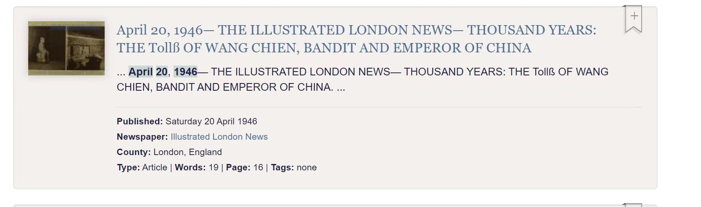

主要是看到“wangchien”就够了，不需要去查看内容

法二：
去线下图书馆直接找（中山大学可以线上查找），xdu可以去线下

#### 2.找公园对面的中医馆

由墓锁定 “ 成都永陵公园 ” ，街景地图找到对面医药馆的牌子，即得

moectf{han_fang_tang}

---
## 解不完的压缩包
使用脚本循环解压999次
```python
import zipfile
import os

zip_file = "999.zip"

dir = "./dir/"

os.makedirs(dir, exist_ok=True)

for i in range(999, 0, -1):
    
    current_zip = f"{i}.zip"
    zip_path = os.path.join(dir, zip_file)
    current_zip_path = os.path.join(dir, current_zip)
    with zipfile.ZipFile(zip_path, 'r') as zip_ref:
        zip_ref.extractall(dir)

    zip_file = current_zip

print("Successfully")
```

解压成功后得到cccccccrc.zip,搜索crc等关键词可以了解一个叫crc碰撞的东西，并且此题正好符合解题要求，可以找crc碰撞脚本，笔者用的为zip-crack

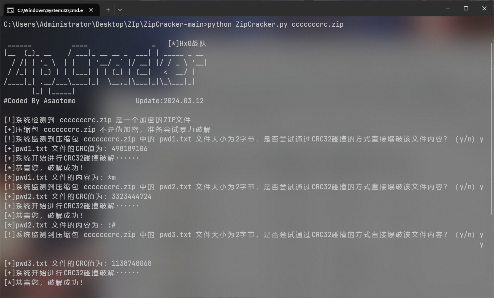

得到key: `*m:#P7j0`解压后得到flag
`moectf{af9c688e-e0b9-4900-879c-672b44c550ea}`

---
## ctfer2077②
注意到题目中的 `法治富强自由富强和谐平等和谐平等法治法治和谐富强法治文明公正自由` 为社会主义核心价值观编码 解码得到 `p@55w0rd`

用vc挂在后 发现只有一个flag？.txt 此外毫无信息根据提示注意到此加密卷的文件系统为ntfs，检索相关的内容可以了解到ntfs隐藏数据流

使用NtfsStreamsEditor可以导出小鹤.txt
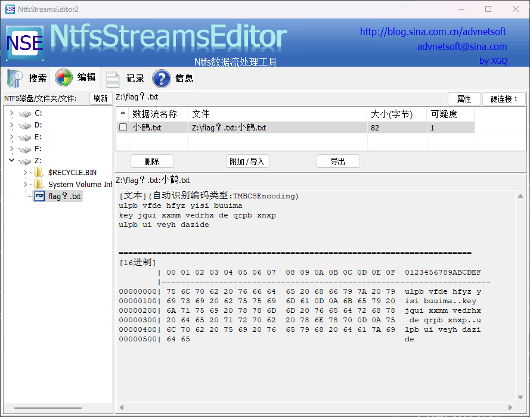

检索了解到小鹤为一种双拼输入法，使用相关输入法可以得到
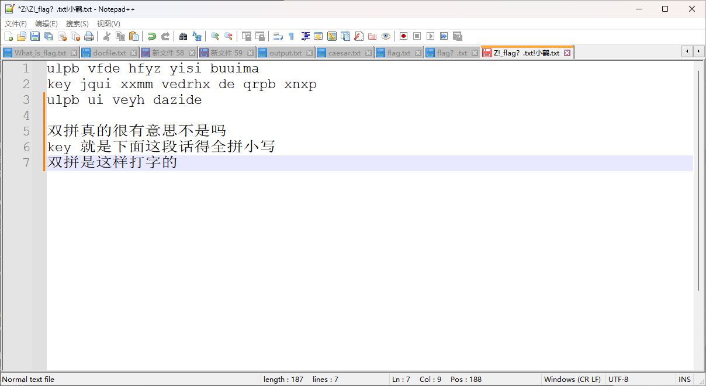

`moectf{shuangpinshizheyangdazide}`

---
## ctfer2077③
注意到给的是一个流量包，协议分级看到大部分数据都集中在http协议，筛选后看具体的内容发现是一个Post请求，上传了一个压缩包，提取进行下一步

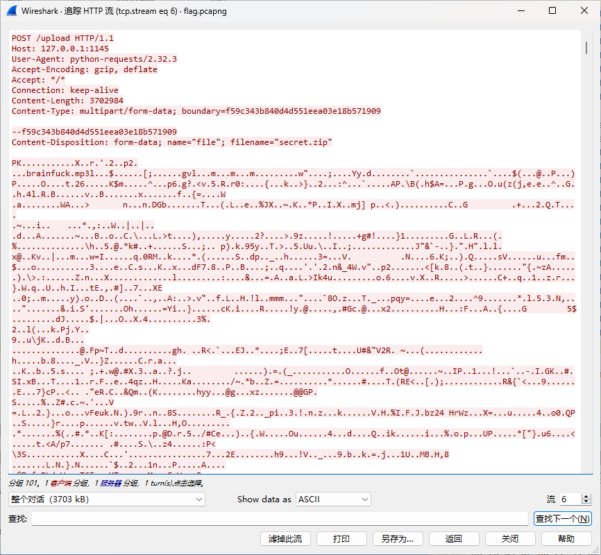

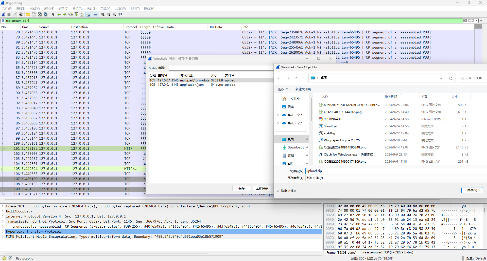

解压出来后有三个文件，将gif图分帧后可以发现key: `C5EZFsC6`


还有一个mp3音频并且给了一个疑似密码的key可以联想到mp3stego
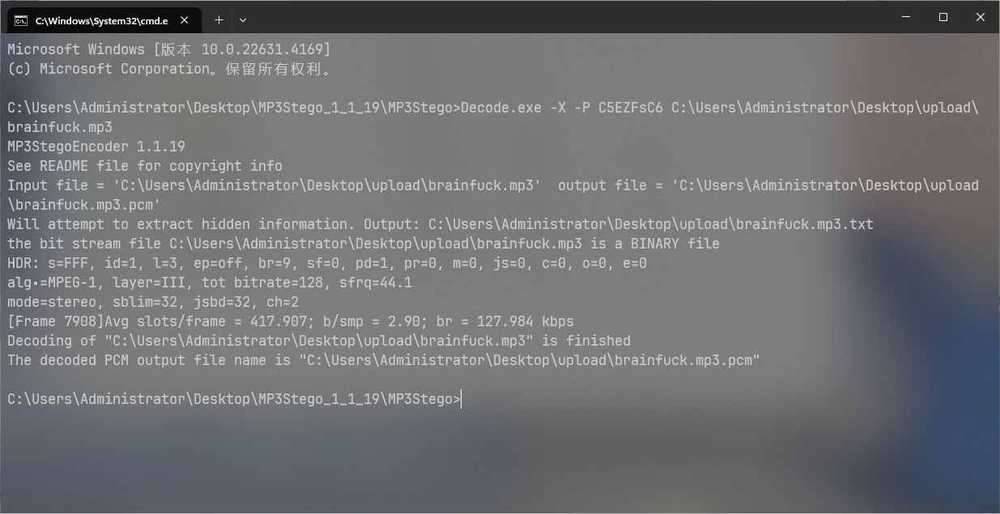
decode后可以得到一串代码
```
+++++ +++[- >++++ ++++< ]>+++ +++++ .<+++ +[->- ---<] >---. <++++ +++[-
>++++ +++<] >+.<+ ++++[ ->--- --<]> ----- -.<++ +[->+ ++<]> +++++ +.<++
+[->- --<]> -.<++ ++[-> ----< ]>--- -.<++ ++++[ ->+++ +++<] >++++ +.<
```
注意到mp3音频名称为brainfuck 检索后发现这是一种语言

使用在线网站得到 key: `H5gHWM9b` 
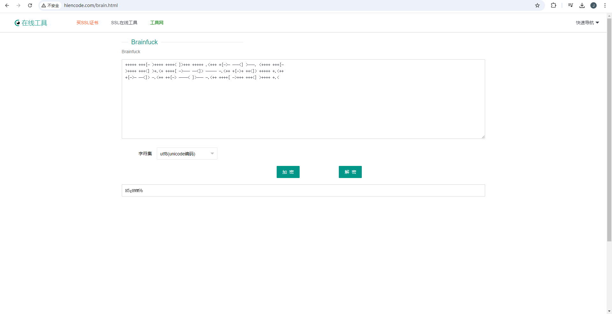

解压压缩包后得到3个txt文本，每个文本内都是01串 缩小后发现是有规律的
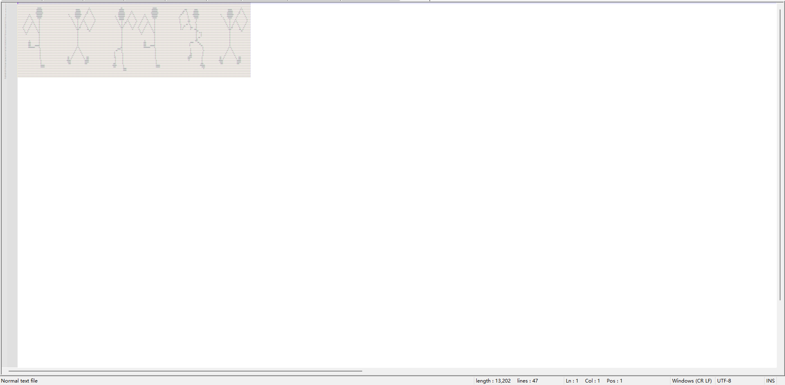

根据提示搜索可以了解这是福尔摩斯探案集中的跳舞的小人，找相关图片解码
（对照表为原书，除原书外的对照表貌似都有些问题，另外原书中的旗帜是分割作用，此处旗帜没任何用处，仅为标志）

最终得到flag 
`moectf{PEOPLE_DANCING_HAPPILY}`

---
## 小小套娃
这题套路题很简单
#### 1.idat隐写
使用pngcheck查看，发现IDAT块错误，推测是IDAT块隐写

手动分离/binwalk提取/最后加的模块，发现是789C开头引入的，zlib解压，import hex

得到一个png文件，二维码扫描得到，就是下一个压缩包的密码
```
送你一个key！you've got the zipkey:874jfy37yf37y7
```

#### 2.txt零宽隐写
记事本打开，复制内容，在下面网站打开
https://yuanfux.github.io/zero-width-web/

得到被隐写的内容是：
idon'tknowmaybeits:dhufhduh48589

就是下一个压缩包的密码；

#### 3.佛与论禅
内容在以下网站解密
http://hi.pcmoe.net/buddha.html
即得flag：
moectf{sfdh8334r784jfx_sdjjuhreubc}

---
## 拼图糕手（revenge）
### 补齐二维码：
1. 手动按照缺位，利用画图/在线网站/手机相册/balabala，都可以拼图
2. ImageMagic下的montage + gaps ，感兴趣可以自己搜索（选手IceKnife提供）

拼图扫描即得：
``` 
balabalbalablbalblablbalabala//nihaopintugaoshou//encoded_flag{71517ysd%ryxsc!usv
@ucy*wqosy*qxl&sxl*sbys^wb$syqwp$ysyw!qpw@hs}
```
看到了encoded_flag和encode.py

### encode.py
``` python
def self_encoding(input_text):
    code_setting_first="doanythigfruebcjklmqpswvxz"
    code_setting_sec="ABCDEFGHIJKLMNOPQRSTUVWXYZ"
    number_setting = "0123456789"
    encoded_text=" "
    for x in input_text:
        if x in code_setting_first:
            if ord(x) < 104 :
                num = ord(x) + 19
            elif ord(x) > 115:
                num = ord(x) - 19
            elif 104 <= ord(x) <= 115:
                num = 219 - ord(x)
            encoded_text += chr(num) + " "        

        elif x in code_setting_sec:
            if 64 < ord(x) < 72:
                num = ord(x) + 7  
            elif 71 < ord(x) < 79:
                num = ord (x) - 7 
            elif 78 < ord(x) < 82:
                num = ord(x) + 9 
            elif 87 < ord(x) < 91:
                num = ord(x) - 9 
            elif 81 < ord(x) < 88:
                num = 168 - ord(x) 
            encoded_text += chr(num) + " "
        
        elif x not in number_setting:
            encoded_text += x

    for i in range(len(input_text)):
        if input_text[i] in number_setting:
            if i != len(input_text) -1:
                x = int(input_text[i]) ^ int(input_text[i+1])
                encoded_text += str(x) + " "
            elif i == len(input_text) - 1:
                encoded_text += input_text[-1]
    return encoded_text
```
先解决key，加密的key只含字母，所以只需要研究加密函数有关于字母的部分，写解密函数，把符号和不等号换一下得到的解密函数基本没有问题（我把加密函数里的`>`换成`>=`了，这样看上去方便一点）

### decode.py
```python
def decode(pwd):
    code_setting_first="doanythigfruebcjklmqpswvxz"
    code_setting_sec="ABCDEFGHIJKLMNOPQRSTUVWXYZ"
    number_setting = "0123456789"
    decoded_text = " "
    for x in input_text:
        if x in code_setting_first:
            if 116 <= ord(x) <= 122:
                num = ord(x) - 19
            elif 103 >= ord(x) >= 97:
                num = ord(x) + 19
            elif 115 >= ord(x) >= 104:
                num = 219 - ord(x)
            decoded_text += chr(num)    

        elif x in code_setting_sec:
            if 72 <= ord(x) <= 78:
                num = ord(x) - 7
            elif 65 <= ord(x) <= 71:
                num = ord(x) + 7
            elif 88 <= ord(x) <= 90:
                num = ord(x) - 9
            elif 79 <= ord(x) <= 81:
                num = ord(x) + 9
            elif 86 >= ord(x) >= 81:#此题确实在这里有些问题就是说,81对应了两个字符,诚恳道歉，但不影响flag输出
                num = 168 - ord(x)
            decoded_text += chr(num)    

        elif x not in number_setting:
            decoded_text += x   

    for i in range(len(input_text)):
        if input_text[i] in number_setting:
            if i != len(input_text) - 1:
                x = int(input_text[i]) ^ int(input_text[i + 1])
                decoded_text += str(x) + " "
            elif i == len(input_text) - 1:
                decoded_text += input_text[-1]#此题encoded_flag中71517回文可以直接用
```
得到
```hs@dkj!dfhf$kdjfh$ud^hfuh*oeh&oej*fhljd*fvb@chb!vhefi%whf52367```


### StrangeChacterHint

研究strangecharacterhint之后，可以得到StrangeCharacterStaywithNumberOnSomewhere,此题hint确实没有给全，所以最后补了个hint
“strange character不能现身flag，对应的数字总是作为他的替身现身flag”，将其中的！@#%替换做数字 即得flag：
```moectf{hs2dkj1dfhf4kdjfh4ud6hfuh8oeh7oej8fhljd8fvb2chb1vhefi5whf52367}```
